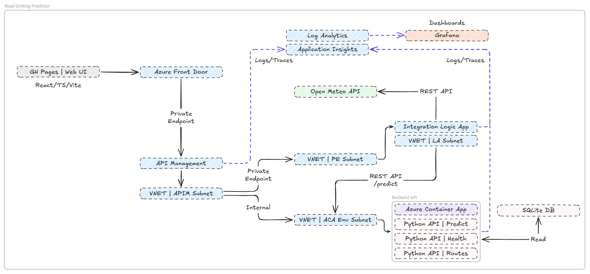

# Road Gritting ML Predictor

Machine learning-based road gritting decision system with weather integration. This system predicts whether roads need gritting and calculates the optimal salt amount based on weather conditions and route characteristics.

## Features

- 🎯 **Multi-output ML Prediction**: Predicts both gritting decision (yes/no) and salt amount
- 🌦️ **Weather Integration**: Automatically calculates ice and snow risk from weather data
- 🛣️ **Route-based Predictions**: Takes into account route priority, length, and type
- 🔌 **Multiple API Options**: Choose between Python, .NET, or Azure Logic Apps
- 🐳 **Docker Support**: Containerized deployment with Docker Compose
- 📊 **Training Dataset**: Synthetic Edinburgh gritting data based on UK standards
- 🧮 **Smart Risk Calculation**: Follows NWSRG (UK National Winter Service Research Group) guidelines

## API Options

This project provides **three API implementations** to suit different technology stacks and deployment preferences:

| Option | Technology | Best For |
|--------|------------|----------|
| **Python API** | Flask + scikit-learn | Data science teams, rapid prototyping |
| **.NET API** | ASP.NET Core + ML.NET | Enterprise .NET environments |
| **Azure Logic Apps** | Logic Apps Standard | Serverless orchestration, Azure-native solutions |

## Quick Start

Choose one of the three API options below:

---

### Option 1: Python API (Recommended for Data Science)

#### Docker (Recommended)

```bash
# Clone the repository
git clone https://github.com/goncalvesj/road-gritting-predictor.git
cd road-gritting-predictor/python-api

# Run with Docker Compose
docker-compose up -d

# The API will be available at http://localhost:5000
```

To stop: `docker-compose down`

For development with hot-reload:
```bash
docker-compose --profile dev up gritting-api-dev
# Development server available at http://localhost:5001
```

#### Local Installation

```bash
cd road-gritting-predictor/python-api
pip install -r requirements.txt

# Generate SQLite database from CSV files (first time only)
cd ../data && python csv_to_sqlite.py && cd ../python-api

# Train the models
python model_trainer.py

# Run the API
python gritting_api.py
# API available at http://localhost:5000
```

---

### Option 2: .NET API (Recommended for Enterprise)

#### Docker

```bash
cd road-gritting-predictor/dotnet-api

# Run with Docker Compose
docker-compose up -d

# The API will be available at http://localhost:8080
```

#### Local Installation

```bash
cd road-gritting-predictor/dotnet-api

# Build and run
dotnet run

# API available at http://localhost:5000
```

**Note:** The .NET API uses ML.NET models. Train the models first using the dotnet-model-trainer:
```bash
cd ../dotnet-model-trainer
dotnet run
```

---

### Option 3: Azure Logic Apps (Recommended for Serverless/Azure-native)

The Logic Apps implementation acts as an orchestration layer that:
1. Receives prediction requests
2. Fetches weather data from Open-Meteo
3. Processes weather conditions
4. Calls a backend prediction API (Python or .NET)
5. Returns combined results

#### Prerequisites
- [Azure Functions Core Tools v4](https://learn.microsoft.com/en-us/azure/azure-functions/functions-run-local)
- [VS Code](https://code.visualstudio.com/) with [Azure Logic Apps (Standard) extension](https://marketplace.visualstudio.com/items?itemName=ms-azuretools.vscode-azurelogicapps)
- [Azurite](https://learn.microsoft.com/en-us/azure/storage/common/storage-use-azurite) for local storage emulation

#### Local Development

```bash
cd road-gritting-predictor/integration/road-gritting-predictor

# Copy settings file
cp local.settings.json.example local.settings.json

# Start Azurite (in a separate terminal)
azurite --silent

# Start a backend prediction API (Python or .NET) in another terminal
cd ../../python-api && python gritting_api.py

# Start the Logic App
func start

# Workflow available at: http://localhost:7071/api/GetPredictionApi/triggers/manual/invoke
```

See [integration/road-gritting-predictor/README.md](integration/road-gritting-predictor/README.md) for detailed Logic Apps documentation.

---

### Making API Requests

#### Python API / .NET API

```bash
curl -X POST http://localhost:5000/predict \
  -H "Content-Type: application/json" \
  -d '{
    "route_id": "R001",
    "weather": {
      "temperature_c": -3.5,
      "feels_like_c": -7.2,
      "humidity_pct": 88,
      "wind_speed_kmh": 18,
      "precipitation_type": "snow",
      "precipitation_prob_pct": 85,
      "road_surface_temp_c": -4.2,
      "forecast_min_temp_c": -5.0
    }
  }'
```

#### Azure Logic Apps

```bash
curl -X POST http://localhost:7071/api/GetPredictionApi/triggers/manual/invoke \
  -H "Content-Type: application/json" \
  -d '{
    "route_id": "R001",
    "latitude": 55.9533,
    "longitude": -3.1883
  }'
```

**Note:** The Logic Apps workflow automatically fetches weather data from Open-Meteo based on the provided coordinates.

## Project Structure

```
road-gritting-predictor/
│
├── README.md                              # This file
│
├── data/                                  # Training data and routes
│   ├── edinburgh_gritting_training_dataset.csv  # Training data (500 samples)
│   ├── routes_database.csv               # Route metadata
│   ├── gritting_data.db                  # SQLite database (generated)
│   └── csv_to_sqlite.py                  # Script to generate SQLite database
│
├── docs/                                  # Documentation
│   ├── DATASET_README.md                 # Dataset documentation
│   └── SOLUTION_REVIEW.md                # Solution review documentation
│
├── python-api/                            # Python ML prediction API
│   ├── requirements.txt                   # Python dependencies
│   ├── Dockerfile                         # Docker container definition
│   ├── docker-compose.yml                 # Docker Compose configuration
│   ├── model_trainer.py                  # ML model training
│   ├── gritting_predictor.py             # Inference-only prediction service
│   ├── gritting_api.py                   # REST API wrapper (Flask)
│   ├── gritting_data_service.py          # Route data service (SQLite/CSV)
│   ├── open_meteo_weather_service.py     # Open-Meteo weather service
│   └── api.http                          # HTTP test file
│
├── dotnet-api/                           # .NET Core ML prediction API
│   ├── Program.cs                        # API entry point
│   ├── GrittingApi.csproj               # Project file
│   ├── Dockerfile                        # Docker container definition
│   ├── docker-compose.yml               # Docker Compose configuration
│   ├── api.http                         # HTTP test file
│   ├── Models/                          # Data models
│   └── Services/                        # Business logic services
│
├── dotnet-model-trainer/                 # .NET ML model trainer
│   ├── Program.cs                        # Trainer entry point
│   ├── ModelTrainer.csproj              # Project file
│   └── README.md                        # Trainer documentation
│
├── integration/                          # Azure Logic Apps Standard
│   └── road-gritting-predictor/         # Logic App project
│       ├── README.md                    # Logic Apps documentation
│       ├── host.json                    # Host configuration
│       ├── local.settings.json          # Local settings
│       ├── GetPredictionApi/            # Prediction workflow
│       │   └── workflow.json            # Workflow definition
│       └── lib/                         # JavaScript inline code
│
├── web-ui/                               # Web UI (React/TypeScript)
│   ├── src/                             # Source code
│   └── package.json                     # Dependencies
│
├── tests/                                # Test files
│   ├── example_usage.py                 # Usage examples
│   ├── test_backward_compatibility.py   # Backward compatibility tests
│   ├── test_open_meteo.py               # Open-Meteo integration tests
│   └── test_open_meteo_mock.py          # Open-Meteo mock tests
│
└── .github/workflows/                    # CI/CD workflows
    ├── gritting-api-python.yaml          # Python API workflow
    ├── gritting-api-dotnet.yaml         # .NET API workflow
    ├── model-deployment.yaml            # Model deployment workflow
    ├── web-ui.yaml                      # Web UI workflow
    └── deploy-web-ui-pages.yaml         # GitHub Pages deployment
```

## How It Works

### Input
```python
route_id = "R001"  # Queensferry Road
weather_data = {
    "temperature_c": -3.5,
    "road_surface_temp_c": -4.2,
    "precipitation_type": "snow",
    "precipitation_prob_pct": 85,
    # ... more weather features
}
```

### Processing
1. **Route Lookup**: Retrieves route metadata (length, priority, type)
2. **Risk Calculation**: Computes ice and snow risk levels
3. **Feature Engineering**: Combines route + weather features
4. **ML Prediction**: 
   - Decision Model: RandomForest Classifier → Yes/No
   - Amount Model: RandomForest Regressor → Salt amount in kg

### Output
```json
{
  "route_name": "Queensferry Road",
  "gritting_decision": "yes",
  "decision_confidence": 0.95,
  "salt_amount_kg": 1360,
  "spread_rate_g_m2": 40,
  "estimated_duration_min": 52,
  "ice_risk": "high",
  "snow_risk": "high",
  "recommendation": "High priority - high ice risk, high snow risk"
}
```

## Dataset

The training dataset contains **500 samples** from synthetic Edinburgh winter gritting operations with:

- **7 routes** (Queensferry Road, Leith Walk, Morningside Road, etc.)
- **16 weather features** (temperature, humidity, wind, precipitation, etc.)
- **4 target variables** (decision, salt amount, spread rate, duration)
- **Balanced classes**: 54% gritted vs 46% not_gritted
- Based on **UK NWSRG standards** for spread rates (20-40 g/m²)

See [docs/DATASET_README.md](docs/DATASET_README.md) for full documentation.

## API Endpoints

### Python API / .NET API

#### POST /predict
Make a gritting prediction with weather data

**Request:**
```json
{
  "route_id": "R001",
  "weather": { ... }
}
```

**Response:**
```json
{
  "success": true,
  "prediction": {
    "gritting_decision": "yes",
    "salt_amount_kg": 850,
    ...
  }
}
```

#### POST /predict/auto-weather
Fetch weather automatically from API. Uses **Open-Meteo** as the primary weather provider (no API key required). Falls back to OpenWeatherMap if `OPENWEATHER_API_KEY` environment variable is set and Open-Meteo is unavailable.

**Request:**
```json
{
  "route_id": "R001",
  "latitude": 55.9533,
  "longitude": -3.1883
}
```

**Weather Provider:**
- **Primary**: [Open-Meteo](https://open-meteo.com/) - Free, open-source weather API with no API key required
- **Fallback**: OpenWeatherMap - Requires `OPENWEATHER_API_KEY` environment variable

#### GET /routes
List all available routes

#### GET /health
Health check endpoint - returns API status and whether models are loaded

### Azure Logic Apps

#### POST /api/GetPredictionApi/triggers/manual/invoke
Orchestrated prediction workflow that automatically fetches weather data

**Request:**
```json
{
  "route_id": "R001",
  "latitude": 55.9533,
  "longitude": -3.1883
}
```

**Response:**
```json
{
  "success": true,
  "prediction": {
    "gritting_decision": "yes",
    "salt_amount_kg": 500,
    ...
  },
  "weather": {
    "temperature_c": -2.5,
    "precipitation_type": "snow",
    ...
  },
  "weather_source": "open-meteo"
}
```

## Extending the System

### Add New Routes
Edit `data/routes_database.csv`:
```csv
route_id,route_name,priority,road_type,route_length_km
R008,New Road Name,1,A-road,15.5
```

### Add More Training Data
Append to `data/edinburgh_gritting_training_dataset.csv` and retrain:
```bash
cd python-api
python model_trainer.py
```

### Weather Provider Integration

The system uses **Open-Meteo** as the default weather provider (no API key required).

**Python API:**
- Main service: `python-api/open_meteo_weather_service.py`
- Prediction: `python-api/gritting_predictor.py`
- Integration: `python-api/gritting_api.py` → `fetch_weather_from_api()` function
- Fallback: OpenWeatherMap (if `OPENWEATHER_API_KEY` is set)

**.NET API:**
- Main service: `dotnet-api/Services/OpenMeteoWeatherService.cs`
- Integration: `dotnet-api/Services/WeatherService.cs`
- Fallback: OpenWeatherMap (if `OPENWEATHER_API_KEY` is set)

**Azure Logic Apps:**
- Workflow: `integration/road-gritting-predictor/GetPredictionApi/workflow.json`
- Weather fetching handled via HTTP action calling Open-Meteo API
- JavaScript inline code processes WMO weather codes into precipitation types
- Calls backend prediction API (Python or .NET) with enriched weather data

To use a different weather provider, implement a new weather service class following the existing patterns.

## Model Performance

- **Decision Model Accuracy**: 100% (on test set)
- **Amount Model R² Score**: 0.954 (on gritted instances)
- **Key Features**: precipitation_prob_pct, ice_risk, forecast_min_temp_c, temperature_c

## Sample Azure Architecture



## UK Standards Compliance

The system follows **NWSRG (National Winter Service Research Group)** guidelines:

| Spread Rate | Conditions |
|-------------|------------|
| 20 g/m² | Light frost prevention, road temp 0-1°C |
| 25 g/m² | Standard preventive gritting, temp -1 to 0°C |
| 30 g/m² | Moderate conditions, sleet/light snow |
| 35 g/m² | Severe frost/ice, temp -3 to -4°C |
| 40 g/m² | Heavy snow or extreme ice, temp < -4°C |

## Data Sources

- **Edinburgh Council Open Data**: https://github.com/edinburghcouncil/datasets-transport
- **NWSRG Guidelines**: https://nwsrg.org/practical-guidance-documents
- **UK Met Office**: Road weather information standards
- **Open-Meteo Weather API**: https://open-meteo.com/ - Free, open-source weather data with no API key required

## License

MIT License - See LICENSE file for details

## Contributing

Contributions welcome! Please:
1. Fork the repository
2. Create a feature branch
3. Submit a pull request

## Support

For questions or issues, please open a GitHub issue.

## Future Enhancements

- [x] Docker containerization with Docker Compose
- [x] Real-time weather API integration (Open-Meteo, OpenWeatherMap)
- [x] Azure Logic Apps Standard for serverless orchestration
- [ ] Multi-route batch predictions
- [ ] Historical tracking and analytics dashboard
- [ ] Deep learning models (LSTM for time-series prediction)
- [ ] Mobile app integration
- [ ] Live gritter truck tracking
- [ ] Cost optimization algorithms
- [ ] Azure deployment templates (ARM/Bicep)

---

**Built for proof-of-concept winter road maintenance ML applications**
